# 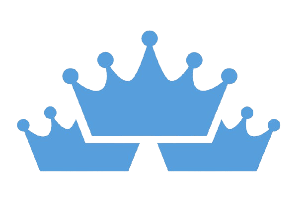

# <span style="color:#1599E6">Triple</span>Crown

# <div style="clear: both;"></div>


**Build your own NFL season projections, then draft from them.**

TripleCrown is a self-contained fantasy football projection tool. Instead of trusting someone else's rankings, you build the season yourself — team by team, slider by slider — and the app turns your projections into live draft rankings entirely from your browser.

---

<!-- Center align -->
<div align="center">
  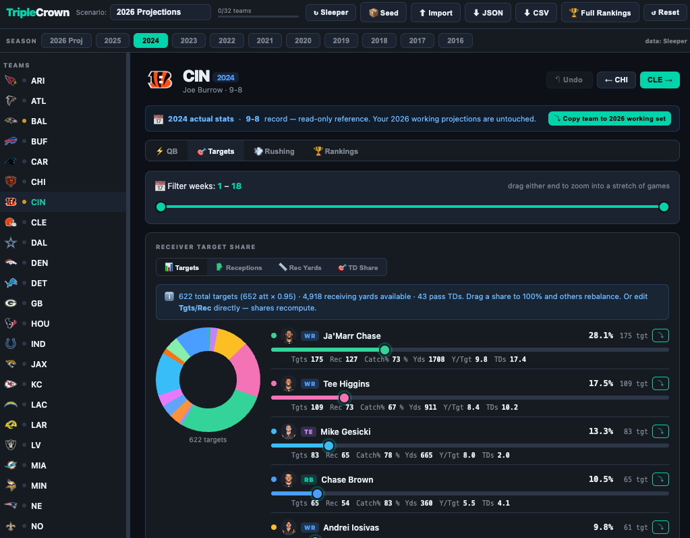
</div>

## What it does

- **Team-by-team projections.** For each of the 32 NFL teams, set QB passing volume, then distribute targets, receptions, receiving yards, and rushing work across the roster with pie-chart sliders. Everything is editable inline — type a number and the rest rebalances.
- **QB games model.** Each QB has a games-played slider (0–17) that drives their pace. A QB set to 0 games contributes nothing to team totals but keeps their per-game rate, so backups and committees behave sensibly.

<!-- Center align -->
<div align="center">
  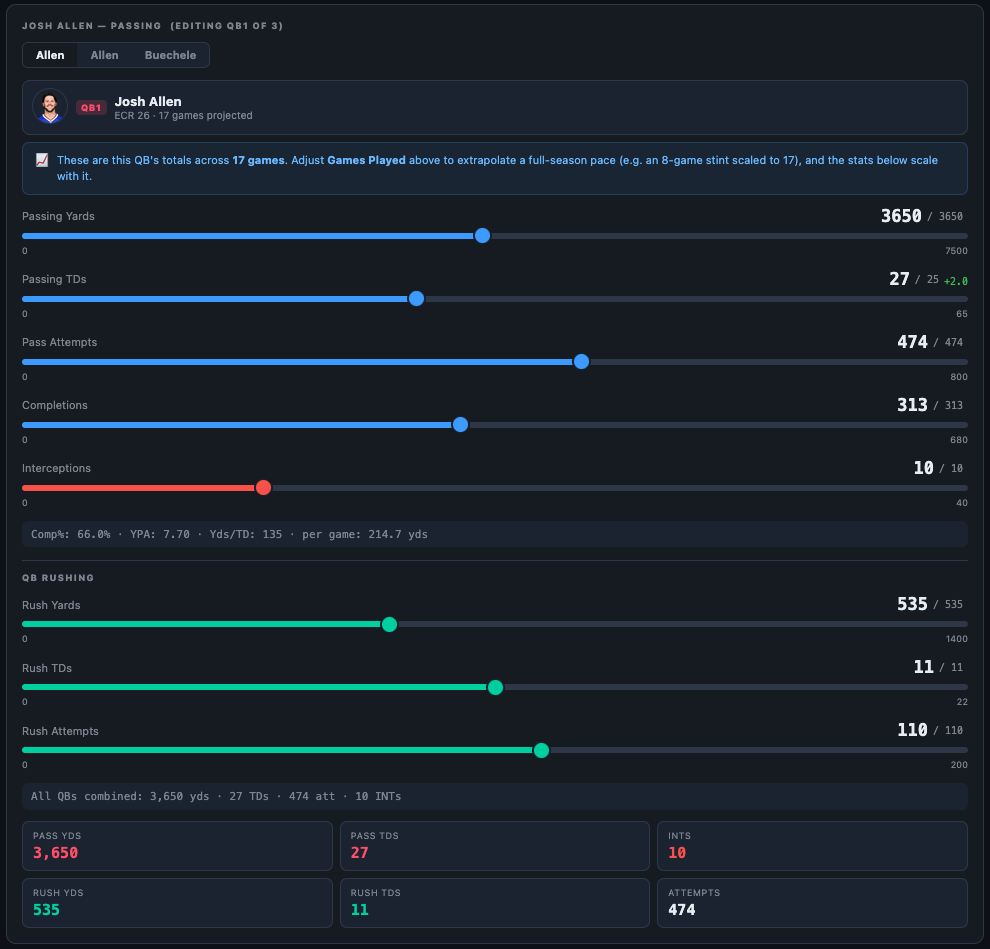
</div>

- **Rankings that follow your scoring.** Your projections become a ranked player board scored by your league's exact settings. Switch between **Full PPR, Half PPR, Standard, Superflex, and Dynasty** — each applies the right scoring *and* pulls the matching FantasyPros Expert Consensus Ranking (ECR) and tier. Change the reception value directly and the format label follows.
- **Link a Sleeper league to auto-detect scoring.** Enter your Sleeper username, pick a league, and TripleCrown reads its scoring settings and format directly — points per reception, yardage values, superflex/dynasty detection — and applies them to the rankings for you.
- **Dynasty contract columns.** In Dynasty mode, the rankings add **Age / APY / Free-Agency year** per player (from OverTheCap). A player whose contract expires next season is highlighted in red — a quick read on who's about to change situations.
- **Advanced metrics on the board.** On the Full Rankings page you can flip the stat columns to per-player **advanced metrics** (EPA, YPRR, success rate, target share, box counts, and more) for any completed season, and a **Situational** dropdown re-cuts them by game situation — Red Zone, When Leading/Trailing, vs. Man/Zone, Play-Action, box-count splits, and so on. Per-position minimum-volume filters keep small samples from cluttering the board.

<!-- Center align -->
<div align="center">
  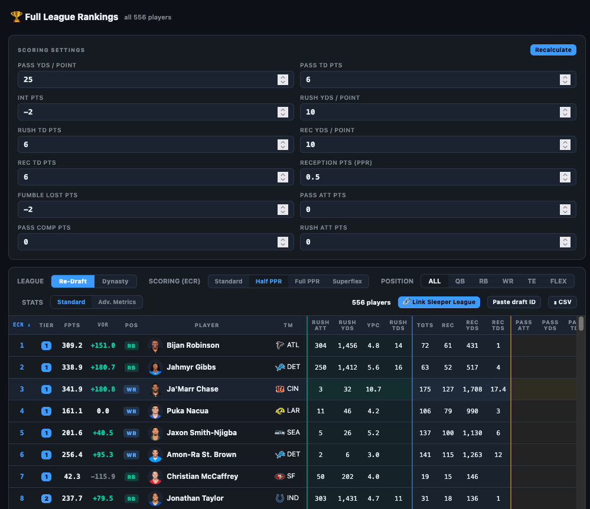
</div>

- **Advanced Stats.** A read-only advanced statistics tab surfaces last season's team-level analytics from Warren Sharp — offensive and defensive line, pace, personnel, tendencies, and coverage. Every stat is league-ranked and color-coded best→worst, per team and league-wide. This is reference context to inform your projections; it never changes them.
- **Strength of schedule.** Each team shows its upcoming-season SOS rank and Vegas win total, plus a league-wide SOS chart.
- **Coaching staff & scheme carryover.** Every team surfaces its head coach (live from ESPN), flags head coaches who call their own plays, and lists the current offensive/defensive coordinators. When a coordinator (or a play-calling head coach) is new this season and came from another team, TripleCrown carries over that former team's scheme tendencies as a forecast — because scheme travels with the play-caller.

<!-- Center align -->
<div align="center">
  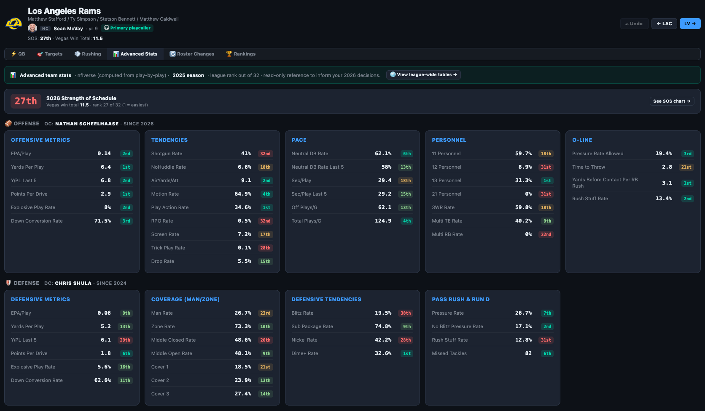
</div>

- **Roster changes.** A per-team **Roster Changes** tab pulls the offseason's free-agent signings, draft picks, trades, and notable free-agent losses from Spotrac — sorted by contract value — so you can see how a team addressed last season's weaknesses (and where new holes may have opened). The same tab also renders the team's current **depth chart** — ordered starters → backups by position slot, live from ESPN.

<!-- Center align -->
<div align="center">
  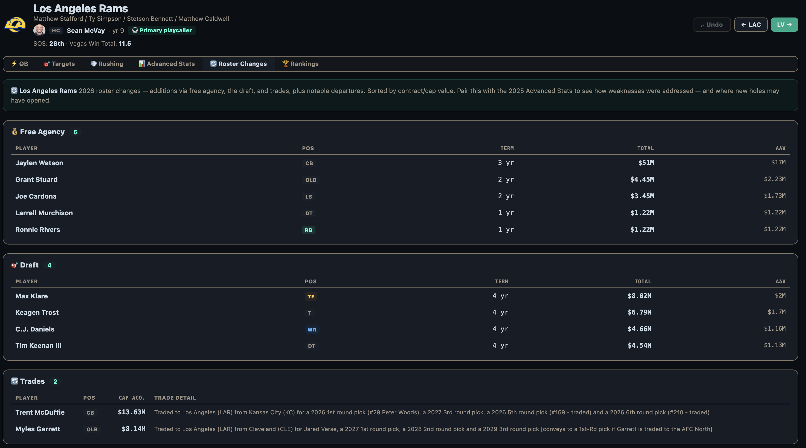
</div>

- **Reference past seasons.** Click any prior season to view real stats, read-only, without touching your working projections. A **week-range slider** lets you filter a player's stats to a stretch of games — e.g. a receiver's hot start before an injury — and see how they compared to the rest of the team over just those weeks.
- **Copy last season into your working set.** Pull a team's (or a single player's) prior-season line into your current projections as a starting point, with per-team **undo**.

<!-- Center align -->
<div align="center">
  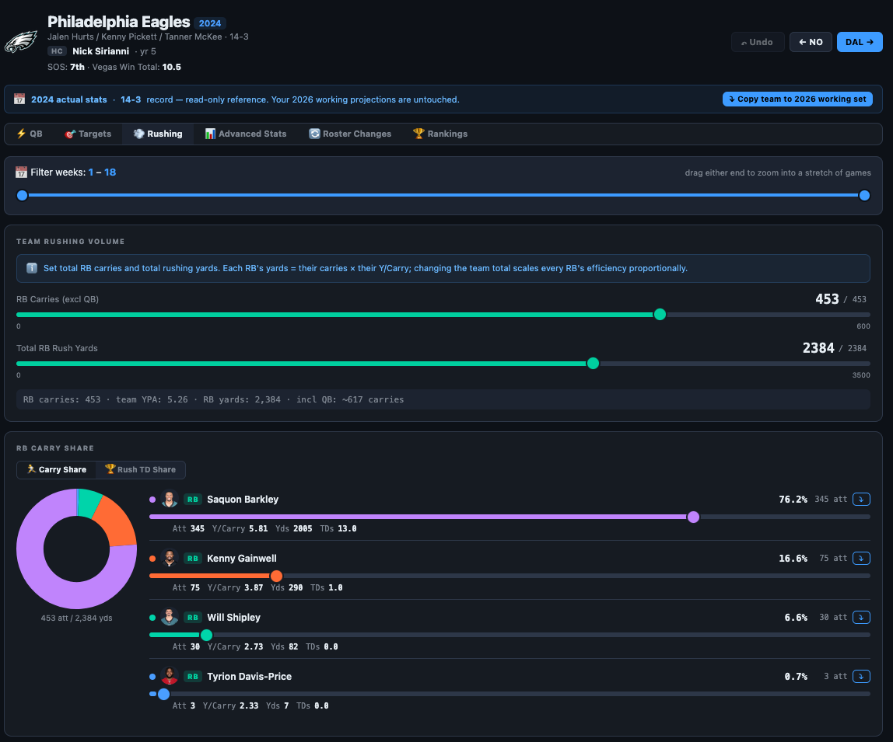
</div>

- **Live draft follow.** Point it at a Sleeper draft and drafted players are marked/hidden on your board in real time. Also follows your drafted team as you draft them with the option of seeing other team's rosters!
- **VOR and VONA BasedRoster Suggestions** Based on your projections, VOR (Value Over Replacement) assigns a value to every player based on what is replacable at their position (per your league settings) and VONA (Value Over Next Available) uses that along with your draft position and live-draft data to help you see where the biggest value drop offs are at each position to better assist your draft decisions!

<!-- Center align -->
<div align="center">
  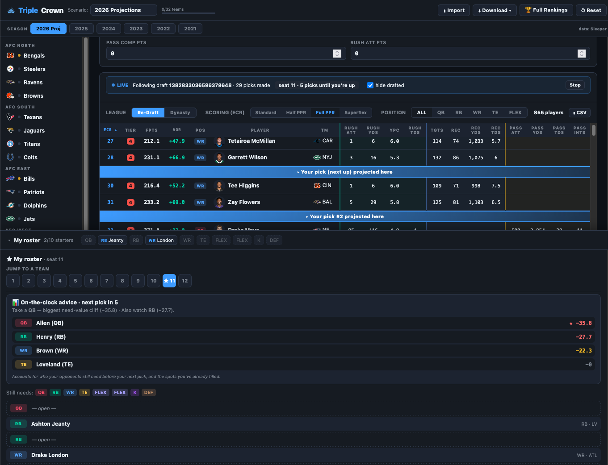
</div>

- **Player Cards.** Every Player has a back story as to how they got here and the best way to see that summarized is in their player card. Here you'll find a summary of their current contract, draft selection and past performance with the added bonus of being able to see their college per game stats as well. Their pro gamelogs are color-graded per game and label playoff weeks by round (WC / DIV / AFC / NFC / SB).

<!-- Center align -->
<div align="center">
  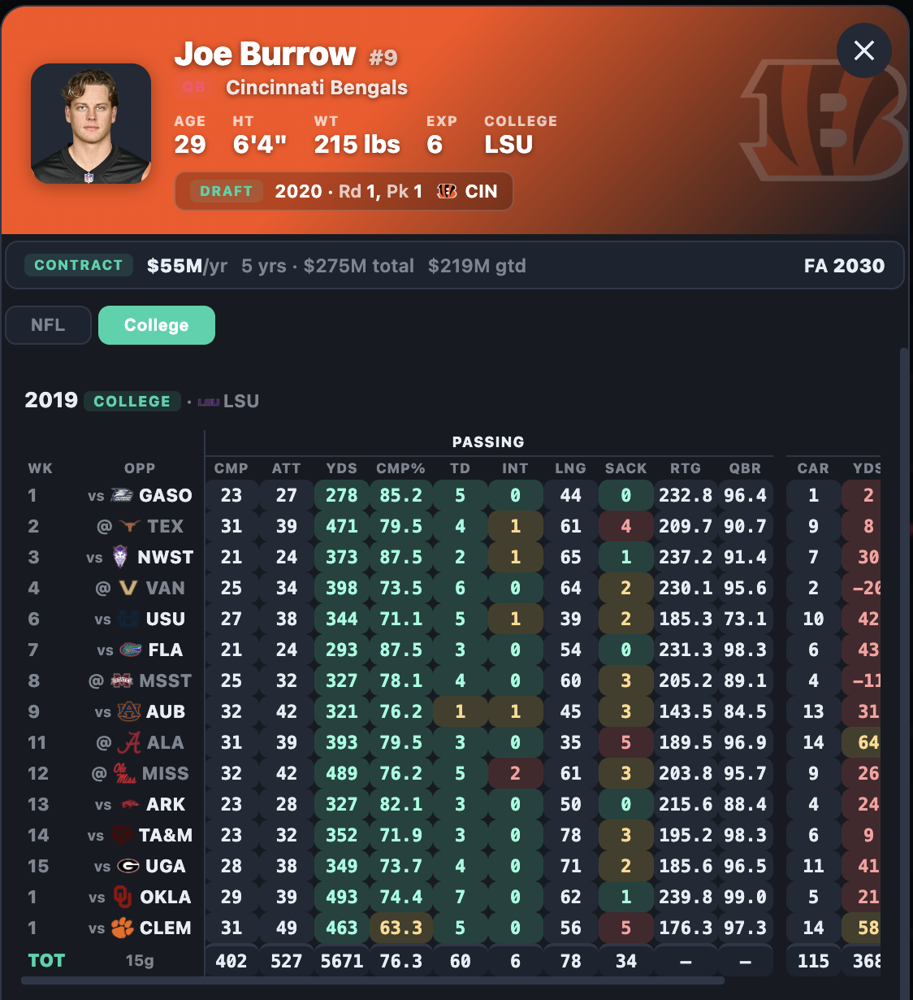
</div>

- **Passing Charts.** Every QB has strengths and weakness and it can difficult to determine what those are when just looking at raw fantasy totals at the end of each week. Introducing Passing Charts attached to every QB's player card where you can visually see how a QB performs doing what matters most for fantasy and see beyond the fantasy point totals.

<!-- Center align -->
<div align="center">
  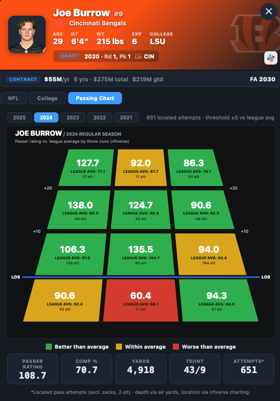
</div>

- **Route Trees.** Every Player that was targeted on routes in the past five seasons has a dedicated tab on their player cards that showcases their route trees. This feature shows what routes receivers tend to run more as they progress in their careers and adds more context to routes run as well as target totals to really showcase what type of receiver this player is.

<!-- Center align -->
<div align="center">
  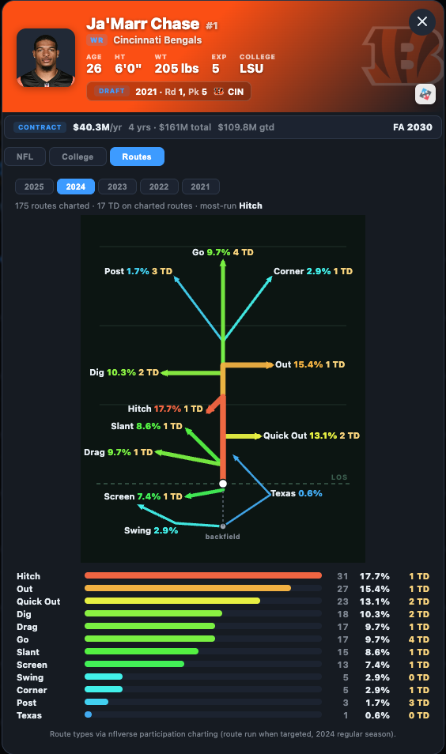
</div>

- **Rushing Fans.** A Major aspect of fantasy football, and the sport itself, that is often overlooked is the offensive line. Although available data for individual OL performance is poor, I created an ever evolving +/- algorithm that hands out rush and pass block grades to every qualifying offensive linemen so that you can see clearly how offensive line talent, performance, entanglement, and health directly affects key areas of the run and pass game with every rusher's rushing fan chart!

<!-- Center align -->
<div align="center">
  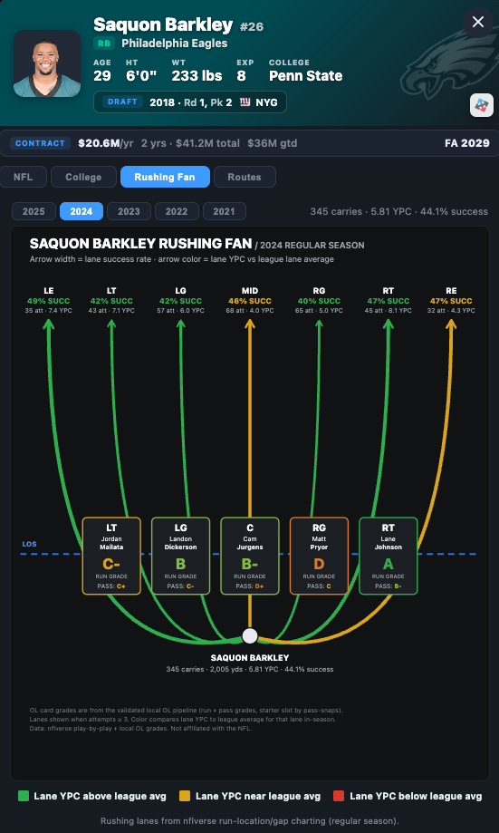
</div>

- **Coaching Schemes.** Every team has been had their personnel groupings, formations, run success rates vs gaps and route concepts mapped into trends in this new visualization tool which allows you to see all the different passing and rushing concepts that these teams rely on in different situations in game!

<!-- Center align -->
<div align="center">
  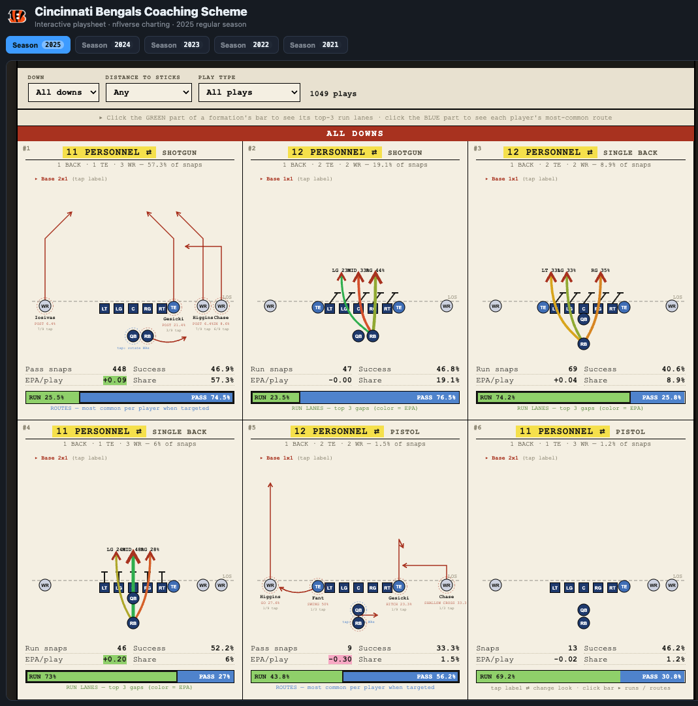
</div>

---

## Quick start

**Just want to use it?** Open `index.html` in any modern browser. On first load it pulls live 2026 projections from Sleeper. That's it.

For the full experience (expert rankings, contracts, advanced stats, coaching, roster changes, prior-season history), build a **seed** — see below.

---

## The project files

| File | What it is |
|------|-----------|
| `index.html` | The entire app, as one self-contained file. Open it in a browser. **Generated from `src/` — don't hand-edit it; edit `src/` and run `python build.py`.** |
| `src/` | The editable source: `src/css/*.css` + `src/js/*.js` (split by feature) and `src/index.template.html` (the shell). |
| `build.py` | Concatenates `src/` back into `index.html`. Output is byte-identical to a hand-edited single file — the shipped app is unchanged. Add `--offline` (optionally `--out index_offline.html`) for a local `file://` copy that includes the 📦 Seed loader button. |
| `build_seed.py` | Run locally to fetch all the data and produce `triplecrown_seed.json`. |
| `bake_seed.py` | Embeds a seed directly into the HTML for a phone-friendly, offline copy. |

> **Why a build step?** The app ships as one file on purpose (works offline from `file://`, bakes onto a phone, zero runtime dependencies). That's great for *users* but unwieldy to *edit*, so the source lives split under `src/` and `build.py` (Python 3 stdlib, no installs) reassembles it. It's plain concatenation — everything stays in one shared scope, so the app and test suite behave exactly as before. `run_tests.sh` rebuilds from `src/` automatically, and `python build.py --check` verifies `src/` matches the committed `index.html`. The default (online) build drops the manual 📦 Seed loader — hosted copies auto-load `triplecrown_seed.json` — while `python build.py --offline` keeps it for a serverless `file://` copy.

---

## Building a seed (recommended)

The app can pull live projections and a few live stats on its own, but several sources **can't be fetched from the browser** — FantasyPros, OverTheCap, Warren Sharp, SumerSports, Wikipedia, and Spotrac aren't reachable from client-side JavaScript (CORS and bot protection). The seed builder runs on your own machine, where there's no such restriction, and bundles everything into one file.

```bash
python build_seed.py                 # 2026 projections + last 5 seasons of stats + all reference data
python build_seed.py --season 2026   # choose the projection season
python build_seed.py --history 5     # how many prior seasons of stats to bundle
python build_seed.py --refresh       # ignore caches and re-download everything
```

It fetches, in order:

1. Sleeper player database
2. Season projections
3. Historical stats (last N seasons, including red-zone opportunities and air yards)
4. Per-team QB weekly splits (so traded QBs land on the right team)
5. FantasyPros ECR — all formats
6. OverTheCap contracts for every position (age / APY / total value / guaranteed / free-agency year)
7. Warren Sharp advanced stats (offense + defense) and strength of schedule
8. SumerSports per-player advanced metrics + situational splits (past seasons, QB/RB/WR/TE)
9. NFL coordinators and head coaches (Wikipedia), plus a maintained play-calling-HC list
10. Spotrac offseason roster changes (free agency, draft, trades, losses)

Output: **`triplecrown_seed.json`** (plus optional sidecars `triplecrown_seed.def_weekly.json` and `triplecrown_seed.coaching.json` for lazy nflverse sections). Requires only Python 3 standard library — no pip installs. Runs are cached in `cache/`, so re-runs are fast; use `--refresh` to force a re-download.

**Load it into the app** by placing it next to `index.html` when hosted over http(s) — it auto-loads on page open. (Manual seed-loading is offline-only: a `python build.py --offline` build adds a 📦 Seed button for loading a `triplecrown_seed.json` by hand from `file://`; the hosted/online build omits it since it auto-loads.)

---

## Hosting for beta / sharing

Because it's a static site, hosting is trivial and free. **GitHub Pages** is the tightest fit:

1. Create a **public** repo.
2. Upload `index.html` plus `triplecrown_seed.json` to the repo root.
3. (Optional) add an empty `.nojekyll` file to the root.
4. **Settings → Pages → Source: `main` / `root` → Save.**
5. Wait ~1–2 minutes; your site is live at `https://<username>.github.io/<repo>`.

Served over `https://`, the browser can fetch `triplecrown_seed.json` normally (no CORS block), so your data auto-loads. Your update loop becomes: run `build_seed.py` → commit the new `triplecrown_seed.json` → Pages republishes automatically.

> Vercel (drag-and-drop a folder at vercel.com) works equally well if you prefer it.

---

## Using it on a phone, fully offline

Opening the HTML directly from a phone uses the `file://` protocol, where browsers block `fetch()` — so the app can't auto-load a seed sitting next to it. The fix is to **bake** the seed into the HTML itself:

```bash
python bake_seed.py
# reads ./triplecrown_seed.json + ./index.html → writes index_baked.html
```

AirDrop or email `index_baked.html` to your phone and open it. Projections, history, ECR, contracts, advanced stats, coaching, and roster changes are all embedded — zero network requests, works offline. (A baked file is a snapshot; re-run `bake_seed.py` after building a fresh seed.)

---

## How the data flows

```
build_seed.py  --fetches-->  Sleeper (projections, stats, weekly splits, red-zone)
      |                       FantasyPros (ECR + tiers)
      |                       OverTheCap (contracts, all positions)
      |                       Warren Sharp (advanced stats + strength of schedule)
      |                       SumerSports (advanced metrics + situational splits)
      |                       Wikipedia (coordinators + head coaches)
      |                       Spotrac (offseason roster changes)
      v
triplecrown_seed.json  --loaded by-->  index.html
      |                                    |
      |  (optional)                        +- you build projections
      v                                    v
bake_seed.py  --embeds-->  index_baked.html   rankings scored to your league
   (offline / phone copy)                      + advanced stats + coaching + roster changes
                                               + live Sleeper draft follow
```

- **Live-reachable from the browser:** Sleeper and ESPN APIs (projections, stats, records, head coaches, draft picks).
- **Not browser-reachable (CORS / bot protection):** FantasyPros, OverTheCap, Warren Sharp, SumerSports, Wikipedia, and Spotrac — these must come from `build_seed.py` and a loaded/baked seed.

---

## Notes & limitations

- **Advanced stats, coaching, and roster changes describe the *previous/offseason* period, not your projection.** They're read-only reference context — they never alter your projected numbers. Advanced-stat tables are labeled with the season they cover to avoid confusion.
- **Scheme carryover is a forecast, not a guarantee.** When a new coordinator or play-calling head coach arrives, TripleCrown shows their former team's tendencies as a starting hypothesis for how a unit might shift — use it as a prompt, not a projection.
- **Red-zone / air-yard columns appear only for past seasons.** They're live stats and aren't projectable, so they show only when you're viewing a prior season in the rankings. A missing value shows a dash rather than a zero.
- **Data accuracy is best online.** Some roster-verification steps (e.g. "copy team from last season" filtering out players who left) rely on the live Sleeper roster. Fully offline from a baked file, the app copies the whole reference roster and flags it as unverified.
- **Nothing is saved server-side.** All projections live in the browser session. Reference seasons are read-only and never overwrite your working set.
- **Baked files are snapshots.** Re-run `build_seed.py` then `bake_seed.py` to refresh a phone copy with new data.
- **Default scoring is Half PPR** (0.5 per reception), matching the default rankings format.

---

## Tests

The project ships with a regression suite (Node + Python) covering the projection math, QB games model, week-range filtering, ECR/format sync, Sleeper league linking + scoring detection, dynasty contracts, per-team undo, copy-to-working, Sharp advanced-stat pulling and display, strength of schedule, coordinator/head-coach parsing and scheme carryover, Spotrac roster-change parsing, red-zone rankings, SumerSports advanced metrics + situational splits, player cards (ESPN gamelogs, contract/draft summaries, college stats, playoff-round labels), mobile layout, seed loading/baking, and the season-switching edge cases.

```bash
./run_tests.sh index.html
```

---

## To Do
### New Features
- [ ] Add Flex to Strength Radar
### UI / UX
- [ ] Remove A.I. style emoji's from app and README
- [ ] Improve names for app sections
### Playercards
- [ ] Kicker playercards need color
- [ ] Implement future schedule on player cards with "4-weeks in" defensive rankings per pos
### Audit
- [ ] Review comments and variable names
- [ ] Parse through code that utilized non-TOS sources
- [ ] Steelers QBs still include history QBs
- [ ] Add Coaching History (HCs, OCs, DCs)
- [ ] Improve seed packing mechanism

## License

TripleCrown is licensed under the **[PolyForm Noncommercial License 1.0.0](./LICENSE)**.

In plain terms: you're free to use, run, modify, and share it for any **noncommercial** purpose — personal use, hobby projects, research, study, and use by nonprofits, schools, or government. **Commercial use requires a separate license from the copyright holder.** The project author retains all rights not granted by that license.

This isn't legal advice; the [full license text](./LICENSE) governs.

---

*TripleCrown is a personal projection tool and is not affiliated with the NFL, Sleeper, FantasyPros, ESPN or NFLVerse and data from those sources is used under their respective terms for personal, non-commercial use.*
