# 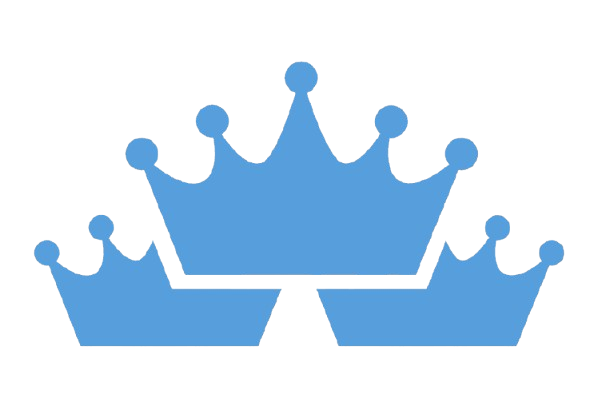

# <span style="color:#1599E6">Triple</span>Crown

# <div style="clear: both;"></div>


**Build your own NFL season projections, then draft from them.**

TripleCrown is a self-contained fantasy football projection tool. Instead of trusting someone else's rankings, you build the season yourself — team by team, slider by slider — and the app turns your projections into live draft rankings entirely from your browser.

---

<!-- Center align -->
<div align="center">
  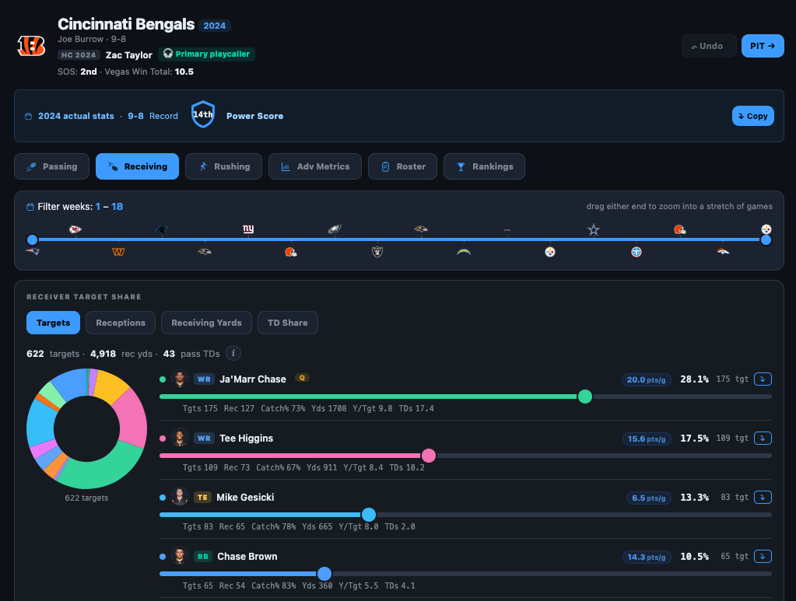
</div>

## What it does

- **Team-by-team projections.** For each of the 32 NFL teams, set QB passing volume, then distribute targets, receptions, receiving yards, and rushing work across the roster with pie-chart sliders. Everything is editable inline — type a number and the rest rebalances.
- **QB games model.** Each QB has a games-played slider (0–17) that drives their pace. A QB set to 0 games contributes nothing to team totals but keeps their per-game rate, so backups and committees behave sensibly.

<!-- Center align -->
<div align="center">
  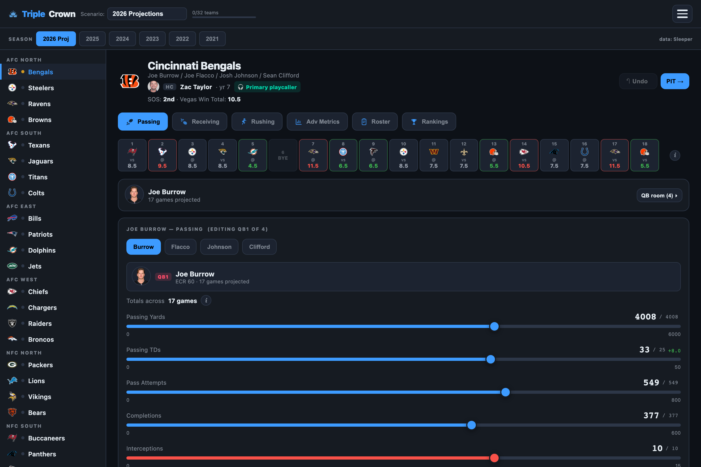
</div>

- **Rankings that follow your scoring.** Your projections become a ranked player board scored by your league's exact settings. Switch between **Full PPR, Half PPR, Standard, Superflex, and Dynasty** — each applies the right scoring *and* pulls the matching FantasyPros Expert Consensus Ranking (ECR) and tier. Change the reception value directly and the format label follows.
- **Link a Sleeper league to auto-detect scoring.** Enter your Sleeper username, pick a league, and TripleCrown reads its scoring settings and format directly — points per reception, yardage values, superflex/dynasty detection — and applies them to the rankings for you.
- **Dynasty contract columns.** In Dynasty mode, the rankings add **Age / APY / Free-Agency year** per player (from OverTheCap). A player whose contract expires next season is highlighted in red — a quick read on who's about to change situations.
- **Advanced metrics on the board.** On the Full Rankings page you can flip the stat columns to per-player **advanced metrics** (EPA, YPRR, success rate, target share, box counts, and more) for any completed season, and a **Situational** dropdown re-cuts them by game situation — Red Zone, When Leading/Trailing, vs. Man/Zone, Play-Action, box-count splits, and so on. Per-position minimum-volume filters keep small samples from cluttering the board.

<!-- Center align -->
<div align="center">
  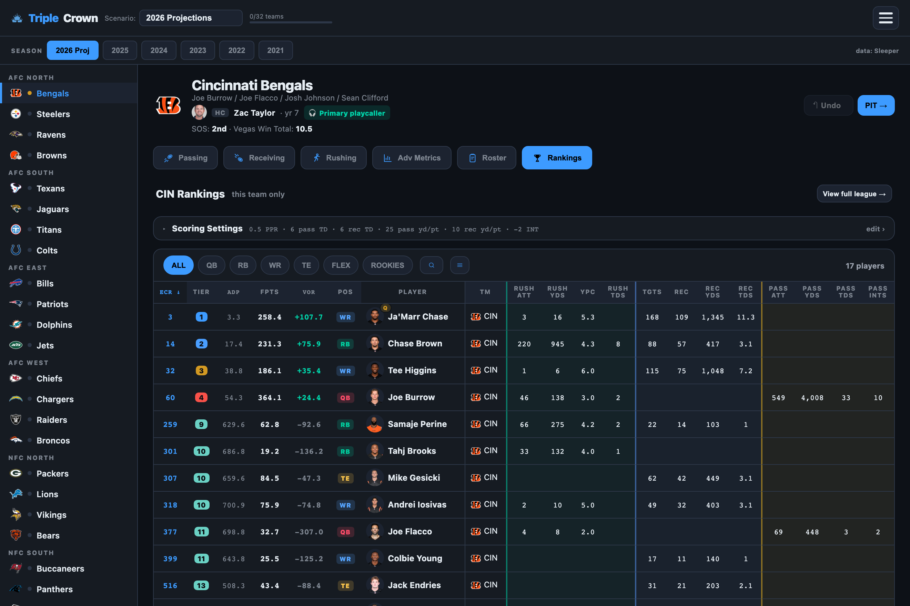
</div>

- **Advanced Stats.** A read-only advanced statistics tab surfaces last season's team-level analytics from Warren Sharp — offensive and defensive line, pace, personnel, tendencies, and coverage. Every stat is league-ranked and color-coded best→worst, per team and league-wide. This is reference context to inform your projections; it never changes them.
- **Strength of schedule.** Each team shows its upcoming-season SOS rank and Vegas win total, plus a league-wide SOS chart.
- **Coaching staff & scheme carryover.** Every team surfaces its head coach (live from ESPN), flags head coaches who call their own plays, and lists the current offensive/defensive coordinators. When a coordinator (or a play-calling head coach) is new this season and came from another team, TripleCrown carries over that former team's scheme tendencies as a forecast — because scheme travels with the play-caller.

<!-- Center align -->
<div align="center">
  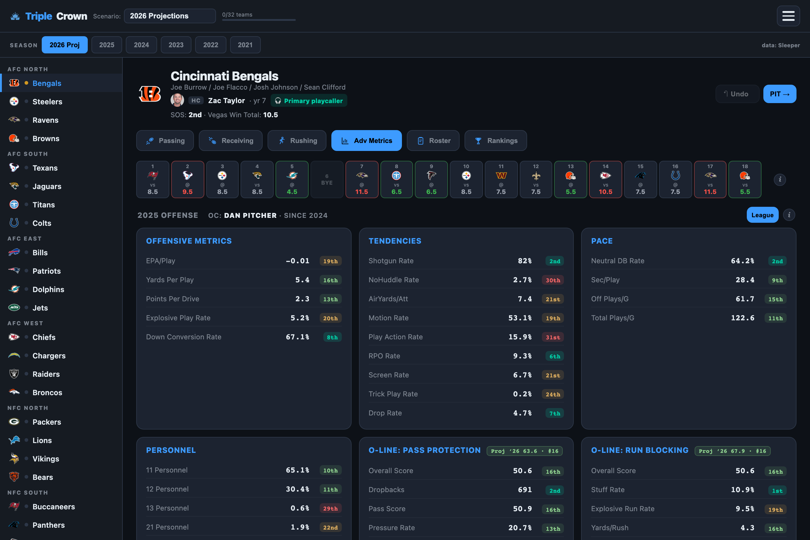
</div>

- **Roster changes.** A per-team **Roster Changes** tab pulls the offseason's free-agent signings, draft picks, trades, and notable free-agent losses derived from nflverse rosters, draft picks and trades — sorted by contract value — so you can see how a team addressed last season's weaknesses (and where new holes may have opened). The same tab also renders the team's current **depth chart** — ordered starters → backups by position slot, live from ESPN.

<!-- Center align -->
<div align="center">
  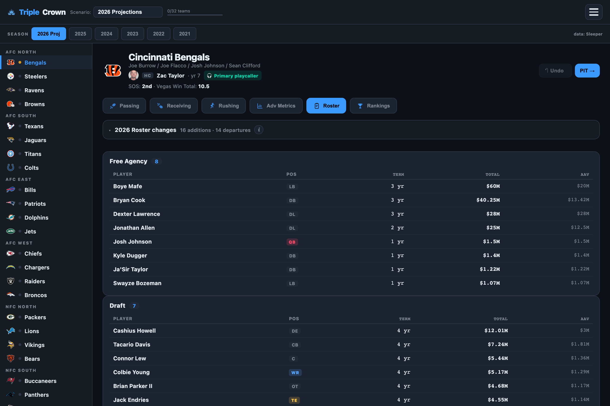
</div>

- **Reference past seasons.** Click any prior season to view real stats, read-only, without touching your working projections. A **week-range slider** lets you filter a player's stats to a stretch of games — e.g. a receiver's hot start before an injury — and see how they compared to the rest of the team over just those weeks.
- **Copy last season into your working set.** Pull a team's (or a single player's) prior-season line into your current projections as a starting point, with per-team **undo**.

<!-- Center align -->
<div align="center">
  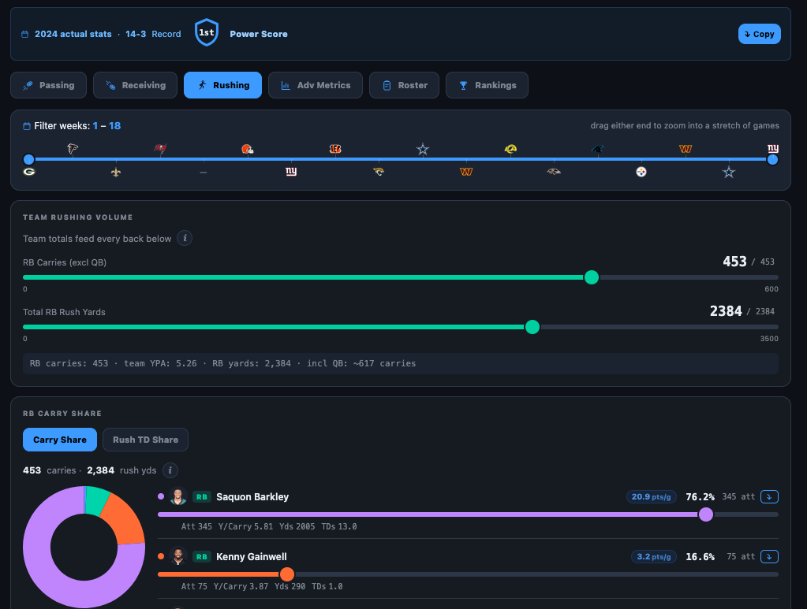
</div>

- **Live draft follow.** Point it at a Sleeper draft and drafted players are marked/hidden on your board in real time. Also follows your drafted team as you draft them with the option of seeing other team's rosters!
- **VOR and VONA BasedRoster Suggestions** Based on your projections, VOR (Value Over Replacement) assigns a value to every player based on what is replacable at their position (per your league settings) and VONA (Value Over Next Available) uses that along with your draft position and live-draft data to help you see where the biggest value drop offs are at each position to better assist your draft decisions!
- **Cloud save + projections manager (optional).** Sign in to save your projection scenarios to Supabase, then load, delete, and drag-to-reorder them in a built-in manager. If you never sign in, everything continues to work locally in-session as usual.
- **Player Notes + stat tagging.** Add notes on any player card and tag important stats directly from rankings/cards into those notes so your own scouting context stays attached to the player.
- **Rankings productivity tools.** Use built-in player search, switch imported analysts when multi-analyst files are loaded, and launch the KeepTradeCut game overlay from the Rankings view.
- **League Analyzer controls.** Sync **Sleeper or ESPN** leagues into explicit snapshots, re-sync on demand, and switch leagues from the menu while keeping all analyzer views tied to the same snapshot context. Whichever platform a league lives on, every player, stat and projection still comes from Sleeper — a linked league contributes only its own teams, owners, rosters, scoring and lineup slots.
- **In-season suite (appears automatically once the NFL season kicks off).** The app tracks Sleeper's NFL state (season, phase, week), and when the regular season starts two things happen. The projections view gains a **Live / Pace** toggle: *Live* shows the current season's actual stats to date as a read-only reference season (red-zone and air-yard columns included), and *Pace* keeps you in your editable projections while showing every player's 17-game pace against **your projections frozen at kickoff** — edit all season without moving your own goalposts. And the League Analyzer gains four swipable in-season tabs: **Matchup** (live weekly scoreboard, your matchup featured, auto-refreshing during games), **Lineup** (optimal lineup vs your set starters, adjusted for opponent defense-vs-position and player pace, with every adjustment footnoted when its data is missing), **DvP** (each defense's fantasy points allowed per game vs QB/RB/WR/TE, scored under *your league's* settings), and **Trends** (pace leaders/laggards, TD-regression candidates from volume-vs-TD-rate gaps, and last-3-weeks usage trending). Advanced weekly data ships in a small in-season sidecar rebuilt weekly by CI from nflverse and retired automatically each offseason.

<!-- Center align -->
<div align="center">
  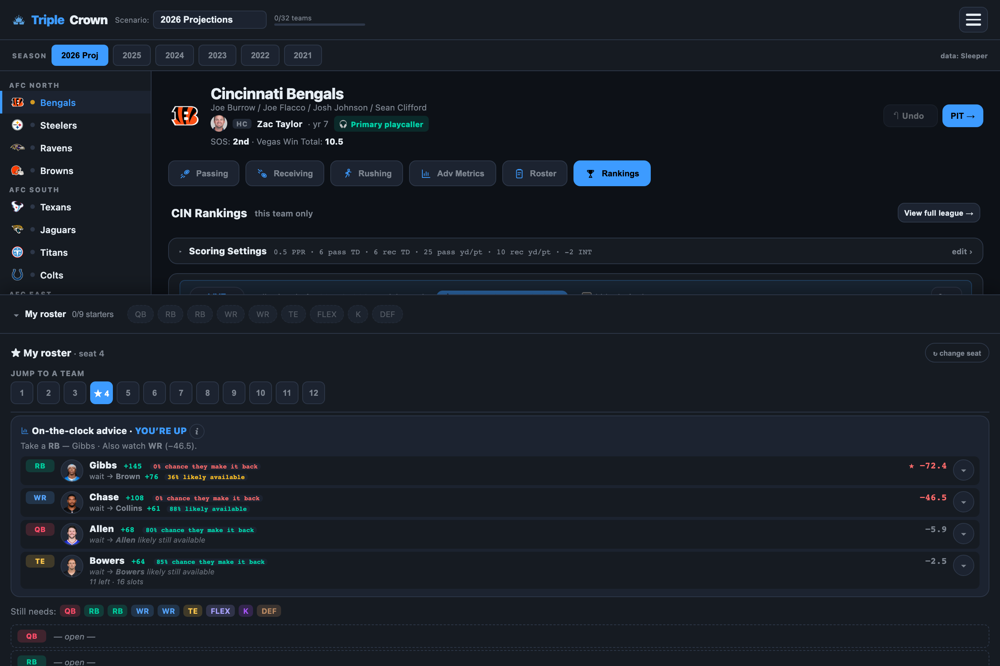
</div>

- **Player Cards.** Every Player has a back story as to how they got here and the best way to see that summarized is in their player card. Here you'll find a summary of their current contract, draft selection and past performance with the added bonus of being able to see their college per game stats as well. Their pro gamelogs are color-graded per game and label playoff weeks by round (WC / DIV / AFC / NFC / SB).

<!-- Center align -->
<div align="center">
  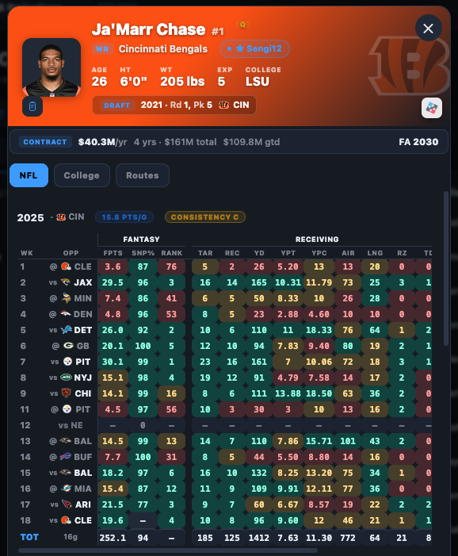
</div>

- **Passing Charts.** Every QB has strengths and weakness and it can difficult to determine what those are when just looking at raw fantasy totals at the end of each week. Introducing Passing Charts attached to every QB's player card where you can visually see how a QB performs doing what matters most for fantasy and see beyond the fantasy point totals.

<!-- Center align -->
<div align="center">
  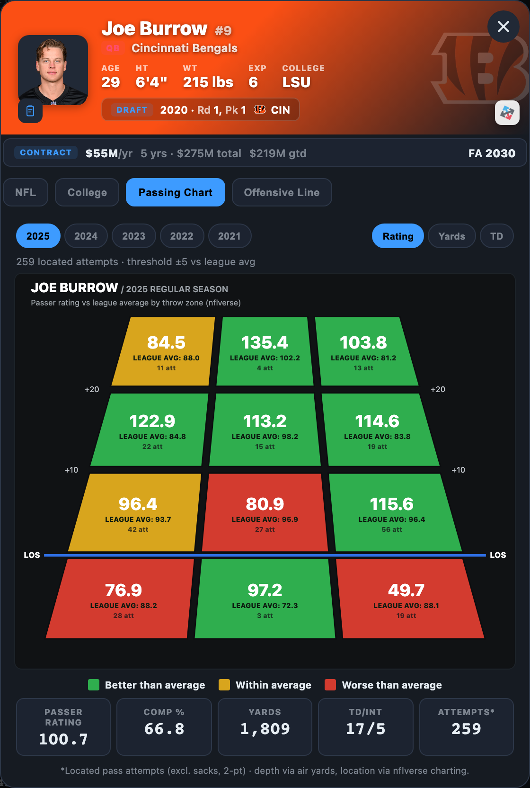
</div>

- **Route Trees.** Every Player that was targeted on routes in the past five seasons has a dedicated tab on their player cards that showcases their route trees. This feature shows what routes receivers tend to run more as they progress in their careers and adds more context to routes run as well as target totals to really showcase what type of receiver this player is.

<!-- Center align -->
<div align="center">
  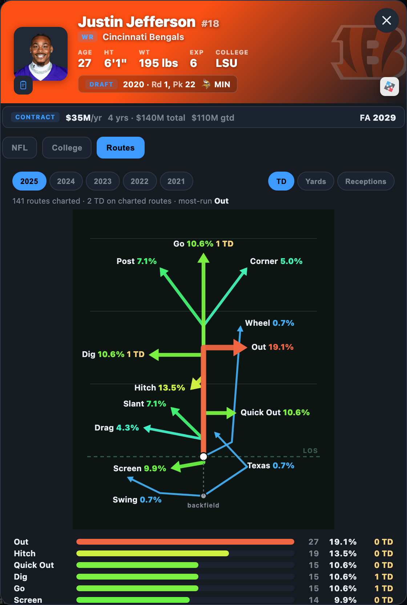
</div>

- **Rushing Fans.** A Major aspect of fantasy football, and the sport itself, that is often overlooked is the offensive line. Although available data for individual OL performance is poor, I created an ever evolving +/- algorithm that hands out rush and pass block grades to every qualifying offensive linemen so that you can see clearly how offensive line talent, performance, entanglement, and health directly affects key areas of the run and pass game with every rusher's rushing fan chart!

<!-- Center align -->
<div align="center">
  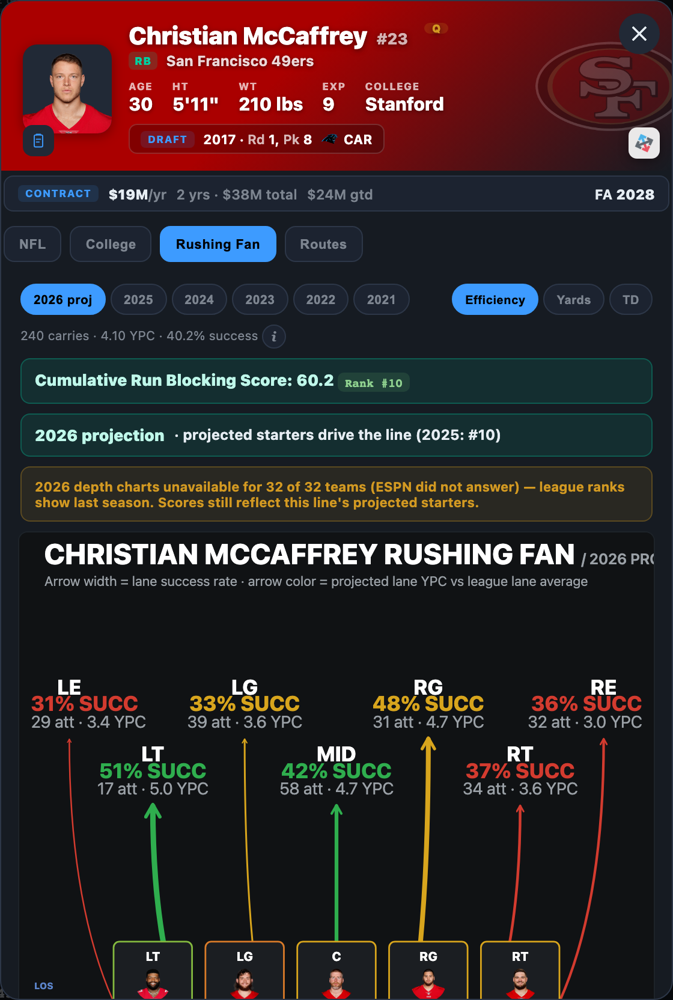
</div>

- **Playbooks.** Every team has been had their personnel groupings, formations, run success rates vs gaps and route concepts mapped into trends in this new visualization tool which allows you to see all the different passing and rushing concepts that these teams rely on in different situations in game!

<!-- Center align -->
<div align="center">
  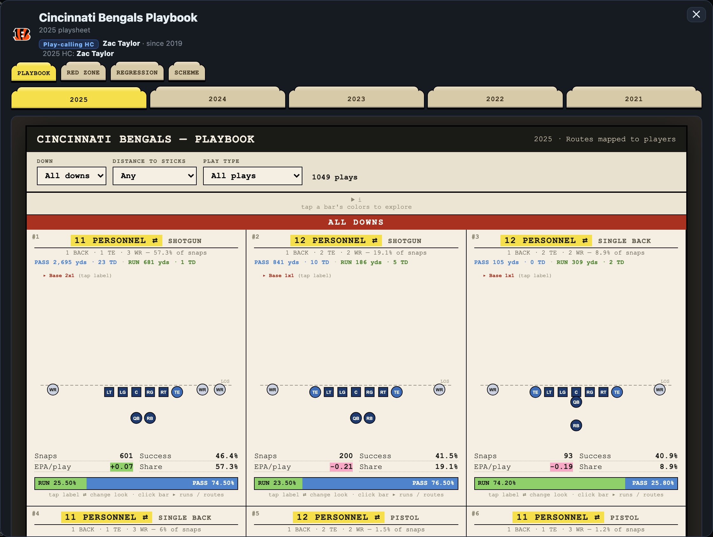
</div>

---

## Quick start

**Just want to use it?** Open `index.html` in any modern browser. On first load it pulls the current season's live projections from Sleeper (the season is detected from Sleeper's NFL state — no yearly code changes). That's it.

For the full experience (expert rankings, contracts, advanced stats, coaching, roster changes, prior-season history), build a **seed** — see below.

---

## The project files

| File | What it is |
|------|-----------|
| `index.html` | The entire app, as one self-contained file. Open it in a browser. **Generated from `src/` — don't hand-edit it; edit `src/` and run `python build.py`.** |
| `src/` | The editable source: `src/css/*.css` + `src/js/*.js` (split by feature) and `src/index.template.html` (the shell). |
| `build.py` | Concatenates `src/` back into `index.html`. Output is byte-identical to a hand-edited single file — the shipped app is unchanged. Add `--dev` for a developer build that includes the 📦 Seed loader button and other developer-only UI. |
| `build_seed.py` | Run locally to fetch all the data and produce `triplecrown_seed.json`. |
| `bake_seed.py` | Embeds a seed directly into the HTML for a phone-friendly, offline copy. |

> **Why a build step?** The app ships as one file on purpose (works offline from `file://`, bakes onto a phone, zero runtime dependencies). That's great for *users* but unwieldy to *edit*, so the source lives split under `src/` and `build.py` (Python 3 stdlib, no installs) reassembles it. It's plain concatenation — everything stays in one shared scope, so the app and test suite behave exactly as before. `run_tests.sh` rebuilds from `src/` automatically, and `python build.py --check` verifies `src/` matches the committed `index.html`. The default build is the normal user-facing app; `python build.py --dev` keeps the manual 📦 Seed loader and other developer-only UI.

---

## Building a seed (recommended)

The app can pull live projections and a few live stats on its own, but several sources **can't be fetched from the browser** — FantasyPros, OverTheCap, Warren Sharp, SumerSports, Wikipedia and nflverse aren't reachable from client-side JavaScript (CORS). The seed builder runs on your own machine, where there's no such restriction, and bundles everything into one file.

```bash
python build_seed.py                    # current-season projections + last 5 seasons of stats + all reference data
python build_seed.py --season 2027      # override the projection season (defaults to Sleeper's NFL state)
python build_seed.py --history 5        # how many prior seasons of stats to bundle
python build_seed.py --refresh sleeper  # re-download one source by name; repeat/comma-separate for more
python build_seed.py --refresh-all      # ignore caches and re-download everything
```

Refresh is per-source — each name maps to one upstream site/API, and anything not named
stays cached: `sleeper`, `ecr`, `dynasty`, `ktc`, `contracts`, `sharp`, `sos`,
`coordinators`, `roster_moves`, `sumer`, `nflverse`, `cfb` (see `--help` for what each covers).

It fetches, in order:

1. Sleeper player database
2. Season projections
3. Historical stats (last N seasons, including red-zone opportunities and air yards)
4. Per-team QB weekly splits (so traded QBs land on the right team)
5. FantasyPros ECR — all formats
6. OverTheCap contracts for every position (age / APY / total value / guaranteed / free-agency year)
7. Warren Sharp advanced stats (offense + defense) and strength of schedule
8. SumerSports per-player advanced metrics + situational splits (past seasons, QB/RB/WR/TE)
9. NFL coordinators and head coaches (Wikipedia), plus a maintained play-calling-HC list
10. nflverse offseason roster changes (free agency, draft, trades, losses)

Output: **`triplecrown_seed.json`** (plus optional sidecars `triplecrown_seed.def_weekly.json` and `triplecrown_seed.coaching.json` for lazy nflverse sections). Requires only Python 3 standard library — no pip installs. Runs are cached in `cache/`, so re-runs are fast; use `--refresh <source>` (or `--refresh-all`) to force a re-download.

**Load it into the app** by placing it next to `index.html` when hosted over http(s) — it auto-loads on page open. (Manual seed-loading is developer-only: a `python build.py --dev` build adds a 📦 Seed button for loading a `triplecrown_seed.json` by hand; the normal build omits it since hosted copies auto-load the seed.)

---

## Hosting for beta / sharing

Because it's a static site, hosting is trivial and free. **GitHub Pages** is the tightest fit:

1. Create a **public** repo.
2. Upload `index.html` plus `triplecrown_seed.json` to the repo root.
3. (Optional) add an empty `.nojekyll` file to the root.
4. **Settings → Pages → Source: `main` / `root` → Save.**
5. Wait ~1–2 minutes; your site is live at `https://<username>.github.io/<repo>`.

Served over `https://`, the browser can fetch `triplecrown_seed.json` normally (no CORS block), so your data auto-loads. Your update loop becomes: run `build_seed.py` → commit the new `triplecrown_seed.json` → Pages republishes automatically.

> Vercel (drag-and-drop a folder at vercel.com) works equally well if you prefer it.

---

## Using it on a phone, fully offline

Opening the HTML directly from a phone uses the `file://` protocol, where browsers block `fetch()` — so the app can't auto-load a seed sitting next to it. The fix is to **bake** the seed into the HTML itself:

```bash
python bake_seed.py
# reads ./triplecrown_seed.json + ./index.html → writes index_baked.html
```

AirDrop or email `index_baked.html` to your phone and open it. Projections, history, ECR, contracts, advanced stats, coaching, and roster changes are all embedded — zero network requests, works offline. (A baked file is a snapshot; re-run `bake_seed.py` after building a fresh seed.)

---

## Testing the in-season tools in the offseason (time machine)

Every in-season feature keys off one clock — Sleeper's NFL state (season · phase · week). The time machine builds a seed as if it were a past regular-season week and freezes that clock, so Live/Pace, the Matchup/Lineup/DvP/Trends tabs, the in-season sidecar and the live season stats all light up against a real season:

```bash
python build_seed.py --as-of 2025:10 --out-dir seeds_tm    # "it is 2025, week 10" (weeks 1–9 complete)
python tools/preview.py --seeds seeds_tm                    # hosted: http://localhost:8080/
python bake_seed.py --seed seeds_tm/triplecrown_seed.json --out index_tm.html   # or a phone copy
```

What the frozen build does: the projection season is 2025 (Sleeper's 2025 preseason projections, so Pace compares real 2025 actuals to real 2025 projections), the state block is `{season:2025, season_type:"regular", week:10, frozen:true}`, the in-season sidecar carries only weeks 1–9 (schedule stays whole — future opponents are the point), and in the app the live Sleeper state probe is skipped while every live pull for the frozen season (season totals, per-player weekly lines) is cut at the completed weeks, so nothing from week 10 onward leaks in. League sync lists your **2025** leagues, so Matchup shows that league's real week-10 scoreboard and Lineup your real week-10 roster. A ⏱ TIME MACHINE chip sits at the bottom of the screen so the copy can't be mistaken for the live app. `--out-dir` keeps `seeds/` (what CI deploys) untouched; the in-season sidecar in `seeds/` is governed by CI, not by this build.

The in-season sidecar (`triplecrown_seed.inseason.json`, rebuilt weekly by CI during the season) also carries a **live nflverse block** for the season in progress — team tables, per-player advanced tables, route trees, QB passing zones, RB rushing fans, rosters and OL weekly — so the player-card charts, the projection view's Advanced tab and the rankings' Adv. Metrics show *this* season to date ("2026 · wk 9") next to the completed seasons, and the time machine truncates all of it to the frozen week.

Not time-travelled (these are "now" data with no history): ECR, contracts, KTC/dynasty values, Sharp/SoS tables, coordinators and New Additions, the Sleeper player DB (current teams, injury designations, vacated-production notes), ESPN head coaches, and the NGS/PFR season-total columns inside the team tables. Use them as UI fixtures, not as week-10-2025 truth.

---

## How the data flows

```
build_seed.py  --fetches-->  Sleeper (projections, stats, weekly splits, red-zone)
      |                       FantasyPros (ECR + tiers)
      |                       OverTheCap (contracts, all positions)
      |                       Warren Sharp (advanced stats + strength of schedule)
      |                       SumerSports (advanced metrics + situational splits)
      |                       Wikipedia (coordinators + head coaches)
      |                       nflverse (offseason roster changes)
      v
triplecrown_seed.json  --loaded by-->  index.html
      |                                    |
      |  (optional)                        +- you build projections
      v                                    v
bake_seed.py  --embeds-->  index_baked.html   rankings scored to your league
   (offline / phone copy)                      + advanced stats + coaching + roster changes
                                               + live Sleeper draft follow
```

- **Live-reachable from the browser:** Sleeper and ESPN APIs (projections, stats, records, head coaches, draft picks), including ESPN's fantasy league endpoints — `lm-api-reads.fantasy.espn.com` and `fan.api.espn.com` reflect the caller's origin back in `access-control-allow-origin`, so league linking needs no proxy, key or server.
- **Not browser-reachable (CORS):** FantasyPros, OverTheCap, Warren Sharp, SumerSports and Wikipedia — these must come from `build_seed.py` and a loaded/baked seed. All are reachable from a server, so `.github/workflows/refresh-seed.yml` refreshes them on a schedule.

---

## Linking an ESPN league

The League Analyzer can snapshot an ESPN league alongside a Sleeper one. **Sleeper remains the
source of every player, stat and projection** — a linked ESPN league contributes only what a
league knows about itself: team names, owners, rosters, records, scoring and lineup slots. Each
ESPN player is resolved to a Sleeper `player_id` (by `espn_id` where Sleeper has one, then by
normalised name + position), so values, VOR, rankings, headshots and player cards all behave
exactly as they do for a Sleeper league.

**How linking works.** Paste your ESPN league link — the address bar while you're looking at
your league. TripleCrown reads that league's manager list and asks **which one is you**; tap your
name and it finds the rest of your ESPN leagues automatically. That happens once: your account is
remembered, and afterwards the ESPN tab opens straight onto your league list, exactly like the
Sleeper tab does with a remembered username.

Why it works this way: ESPN publishes no username lookup, so an account can only be identified by
its SWID — a cookie value no ordinary user can produce. But any public league hands out the
display-name→SWID mapping for everyone in it, so pointing at yourself in a league you're already
in gets there without anyone opening developer tools.

### Known limitations

- **Public leagues only.** ESPN gates private leagues behind the `espn_s2` and `SWID` *cookies*,
  which are set on `espn.com` with no `SameSite` and no `Secure` attribute. Browsers therefore
  treat them as `SameSite=Lax` and never send them cross-site, and `SameSite=None` would require
  `Secure` — so `credentials:'include'` cannot help. This is ESPN's cookie policy, not something
  a page can work around. A private league fails with a message naming the setting to change
  (League Settings → Basic Settings → *Make League Viewable to Public*).
- **No cold username search.** You can't type an ESPN handle and find someone you share no league
  with — ESPN publishes no such endpoint. Identification always starts from a league link.
- **Your league list shows public leagues only.** ESPN's account lookup reports how many leagues
  you're really in, but only lists the ones we're allowed to read; a sampled account showed 9
  leagues with none listed. Leagues we can see but can't read are shown greyed out and tagged
  *private*, so a short list is never mistaken for a broken lookup.
- **No pick capital.** ESPN has no future-pick market or traded-pick feed, so ESPN snapshots
  carry no draft picks and the value lenses score rosters only.
- **No dynasty flag.** ESPN models keepers (`keeperCount`) but has no dynasty league type, so an
  ESPN league never auto-selects the dynasty value lens. The Auto/VOR/Dynasty toggle still forces it.
- **Undocumented endpoint.** ESPN publishes no fantasy API and makes no compatibility promises;
  these are the endpoints its own web client uses. They can change without notice, so every
  failure path degrades to a plain message rather than a broken view.

---

## Notes & limitations

- **Advanced stats, coaching, and roster changes describe the *previous/offseason* period, not your projection.** They're read-only reference context — they never alter your projected numbers. Advanced-stat tables are labeled with the season they cover to avoid confusion.
- **Scheme carryover is a forecast, not a guarantee.** When a new coordinator or play-calling head coach arrives, TripleCrown shows their former team's tendencies as a starting hypothesis for how a unit might shift — use it as a prompt, not a projection.
- **Red-zone / air-yard columns appear only for past seasons.** They're live stats and aren't projectable, so they show only when you're viewing a prior season in the rankings. A missing value shows a dash rather than a zero.
- **Data accuracy is best online.** Some roster-verification steps (e.g. "copy team from last season" filtering out players who left) rely on the live Sleeper roster. Fully offline from a baked file, the app copies the whole reference roster and flags it as unverified.
- **Local-first by default.** If you do not sign in, all projections live in the browser session only. If you sign in, named scenarios can be saved to your own cloud account and reloaded later. Reference seasons are read-only and never overwrite your working set.
- **Baked files are snapshots.** Re-run `build_seed.py` then `bake_seed.py` to refresh a phone copy with new data.
- **A linked league's scoring is adopted whole.** Syncing a league replaces the scoring settings
  with that league's rules, including leagues that award no points for yardage at all (ESPN omits
  a stat entirely when it isn't scored, and TripleCrown reads an omission as zero rather than
  keeping the previous league's value).
- **Default scoring is Half PPR** (0.5 per reception), matching the default rankings format.

---

## Tests

The project ships with a regression suite (Node + Python) covering the projection math, QB games model, week-range filtering, ECR/format sync, Sleeper league linking + scoring detection, ESPN league linking (SWID→leagues, player resolution to Sleeper ids, slot/scoring translation, zero-yardage leagues, public-only guard), dynasty contracts, per-team undo, copy-to-working, Sharp advanced-stat pulling and display, strength of schedule, coordinator/head-coach parsing and scheme carryover, nflverse roster-change derivation, red-zone rankings, SumerSports advanced metrics + situational splits, player cards (ESPN gamelogs, contract/draft summaries, college stats, playoff-round labels), mobile layout, seed loading/baking, and the season-switching edge cases.

```bash
./tests/run_tests.sh index.html
```

---

## To Do
### New Features
- [ ] clicking on a team logo, takes you to that team's current-season projections page anywhere in the app
- [x] add ESPN league support — see **Linking an ESPN league** below (public leagues only)
- [🛠️] add Yahoo league support: needs a server. Yahoo's API sends **no CORS headers at all**, so the
  browser can't call it even with a valid token, and its OAuth2 flow requires a client secret plus hourly
  token refresh. Plan: one Supabase Edge Function doing the code exchange, refresh and read-only proxying.
  Two gates first — Yahoo now gates API access behind an application/approval process and requires
  “Fantasy data provided by Yahoo Fantasy” attribution with their logo; and a Yahoo league would need
  sign-in plus a live connection, which breaks the local-first and baked-offline guarantees above.
- [ ] AWS my own Domain
- [ ] Google Play Store
- [ ] Apple iOS Store
- [ ] Generate my own proprietary projections based on all the metrics we have
### UI / UX
### Playercards
### Live Draft
- [ ] reach out to Sleeper
### League Analyzer
- [ ] In-Season Tools:
  - [x] lineup helper tab
  - [x] live matchup / scoreboard tab (my matchup featured, 45s refresh during games)
  - [ ] Implement future schedule on player cards (the schedule data now ships in the in-season sidecar)
  - [x] defensive rankings per pos that get more accurate as we get more data (each defense ranked against each fantasy position: QB, RB, WR, TE)
  - [x] Rest of season projections
    - [x] Current 17-game pace vs kickoff-frozen projections (Pace toggle + Trends tab)
    - [x] ROS positive regression candidates highlighted (volume percentile vs TD-rate percentile gap)
    - [x] Trending Up and Trending Down players each week (last-3 vs prior-3 target share / touches)
  - [ ] ESPN live matchup scoring (mMatchupScore through the gateway)
### Audit
### Import Projections
### Adv Metrics
- [ ] QB Metrics: on_tgt_throws, bad_throw_pct, batted_balls, is_interception_worthy, is_catchable_ball
- [ ] Charts that show team progress over the last 5 years in specific categories
### Playcalling Stats
- [ ] Improve Playbooks is_qb_sneak, n_offense_backfield

## License

TripleCrown is licensed under the **[PolyForm Noncommercial License 1.0.0](./LICENSE)**.

In plain terms: you're free to use, run, modify, and share it for any **noncommercial** purpose — personal use, hobby projects, research, study, and use by nonprofits, schools, or government. **Commercial use requires a separate license from the copyright holder.** The project author retains all rights not granted by that license.

This isn't legal advice; the [full license text](./LICENSE) governs.

---

*TripleCrown is a personal projection tool and is not affiliated with the NFL, Sleeper, FantasyPros, ESPN or NFLVerse and data from those sources is used under their respective terms for personal, non-commercial use.*
